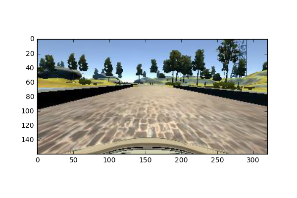
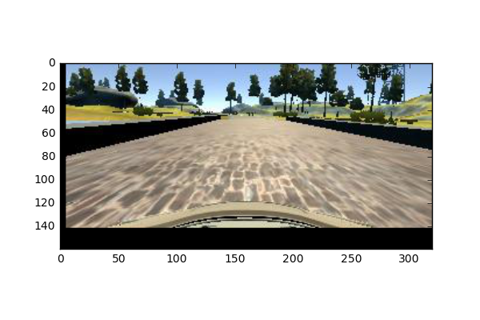
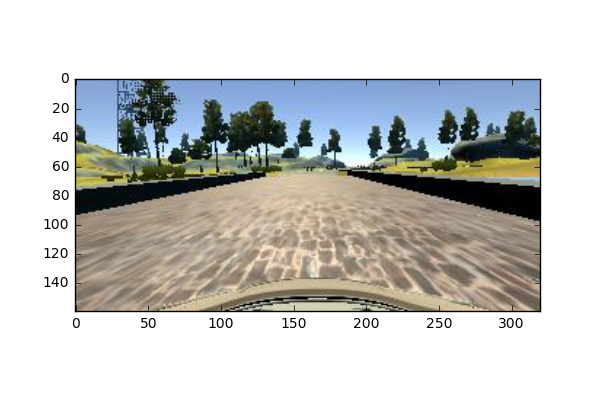
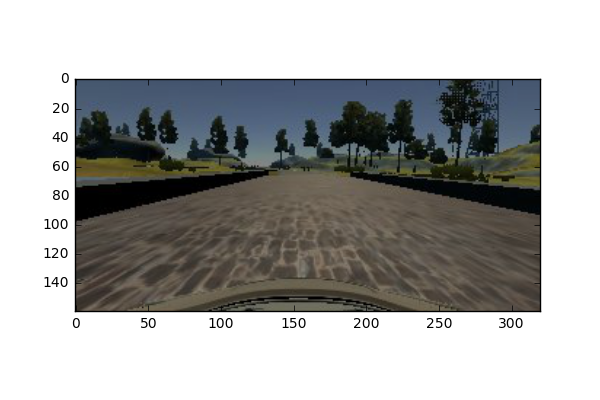

#**Behavioral Cloning** 

---

**Behavioral Cloning Project**

The goals / steps of this project are the following:
* Use the simulator to collect data of good driving behavior
* Build, a convolution neural network in Keras that predicts steering angles from images
* Train and validate the model with a training and validation set
* Test that the model successfully drives around track one without leaving the road
* Summarize the results with a written report

---

## Rubric Points
###Here I will consider the [rubric points](https://review.udacity.com/#!/rubrics/432/view) individually and describe how I addressed each point in my implementation.  

---
###Files Submitted & Code Quality

####1. Submission includes all required files and can be used to run the simulator in autonomous mode

My project includes the following files:
* model.py containing the script to create and train the model
* drive.py for driving the car in autonomous mode
* model.h5 containing a trained convolution neural network 
* writeup_report.md or writeup_report.pdf summarizing the results

####2. Submission includes functional code
Using the Udacity provided simulator and my drive.py file, the car can be driven autonomously around the track by executing 
```sh
python drive.py model.h5
```

####3. Submission code is usable and readable

The model.py file contains the code for training and saving the convolution neural network. The file shows the pipeline I used for training and validating the model, and it contains comments to explain how the code works.

###Model Architecture and Training Strategy

####1. An appropriate model architecture has been employed

The model is comprised of the architecture detailed in [NVIDIA end to end neural network](https://images.nvidia.com/content/tegra/automotive/images/2016/solutions/pdf/end-to-end-dl-using-px.pdf)


####2. Attempts to reduce overfitting in the model

The model contains dropout layers in order to reduce overfitting. 
These dropout layers are both carried out on the fully connected layers of the neural network.
Secondly the data is split into training and validation data sets, with a 1-k hold ration of 9:1

Further testing involved testing the simulation with the above trained model.
####3. Model parameter tuning

The model was instantied using Guassian random noise to prevent the neural net from falling into any local minima.
ADAM optimization was used, so no hyperparameter tuning beyond step size required fine tuning.

####4. Appropriate training data

The test data set provided for the 1st race track was used. This data comprised of rough 8000 image triplets (left, centre, right).
and an accompanying csv file with reference points regarding, training image names and their accompanying details. For the purposes of this project, only image data was used for training. However given more time it would have made significantly more sense to include the throttle values alongside steering angles. 

###Model Architecture and Training Strategy

####1. Solution Design Approach

The overall strategy for deriving a model architecture was to build up the simplest covnet model in keras and iteratively improve results by building larger more sophisticated algorithms - in this case the simplest model was the Le-net 5 architecture and the state of the art NVIDIA architecture or Comma.ai architecture.

My first step was to use a convolution neural network model (Le-net 5) similar to the P2, the traffic sign classification problem. I thought this model might be appropriate because it was a similar problem scope, only difference in this case rather than being used as a classifier it would be modified to give continuous variables. However this did not seem to be able to as effictively capture key features required to appropriately manouvre the vehicle despite low mse error during testing.

Secondly rather than preprocessing input images by taking in the Y channel of YUV images, this architecture made us of fully colored normalized RGB pictures.

####2. Final Model Architecture

The final model was then changed to the NVIDIA architecture as described by [Nvidia architecture](https://images.nvidia.com/content/tegra/automotive/images/2016/solutions/pdf/end-to-end-dl-using-px.pdf)


####3. Creation of the Training Set & Training Process
Being aware that I was working with a limited data set I chose to use a generator that took images from the test set and augmented them in several ways, this was inspired by the [blog post](https://blog.keras.io/building-powerful-image-classification-models-using-very-little-data.html). The data set was augmented in the following means:
Given the original image:



* Add  translational jitter to image data, this is in the form vertical and horizontal shifts.



* Flip images over to make data symetrical. 



* Add random shadowing to image



A generator when called by the model.fit.generator, would then randomly augment the initial data set and produce more data for training. This led to ALOT of troubleshooting as to whether or not the data pipeline was adequately passing info to the model.fit.generator as this expanded data set did not lead to the expected model improvements.

The generator generated 30,000 augmented training images for every epoch.
The submitted model was trained for 10 epochs before the car could adequately navigate around the track.

As earlier mentioned it was a massive oversight not recognizing tha the images captured in the test set were collected at varying limited throttle magnitudes. Lowering this value during model simulation testing led to better expected results. As a side note should the data have been collected with a single throttle value, this would not have a been an issue during replication.

####4. Suggested model improvement
After training the vehicle could adequately navigate around the track, however the smoothness of the driving could've been further improved by:

* Collecting larger training data set, with more diverse steering angles and throttle magnitudes.
* Implement archicture that takes throttle, brake and steering labels given an image: this makes the model more effective at
determing the correct steering angle
* Look into using a CovRNN architecture which is probably significantly more effective at capturing adequate steering angles, as this problem can be modelled as a markov chain.
